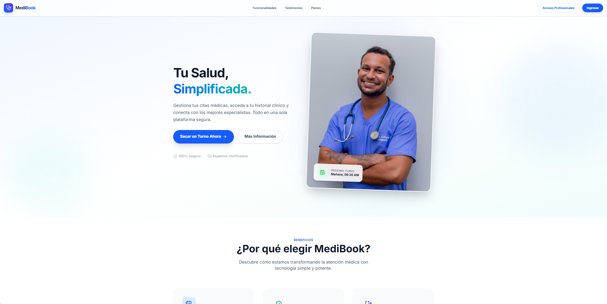
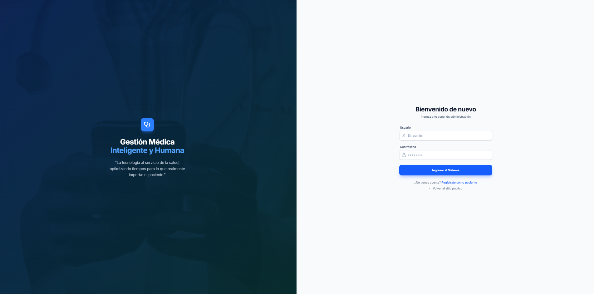
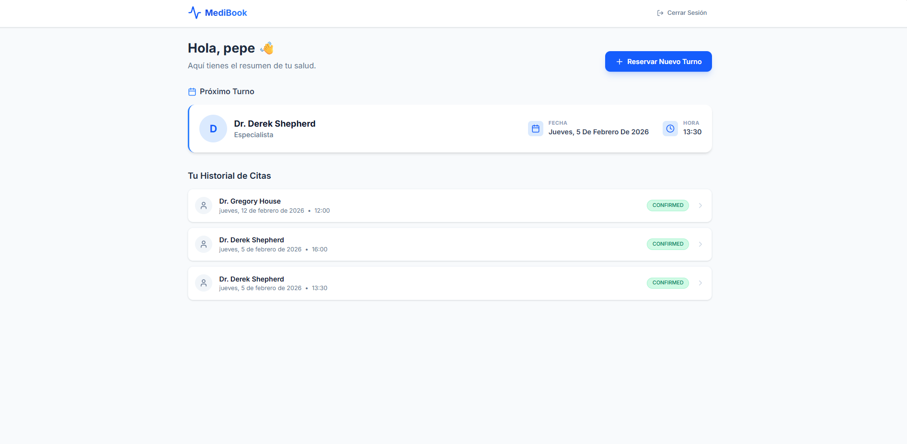
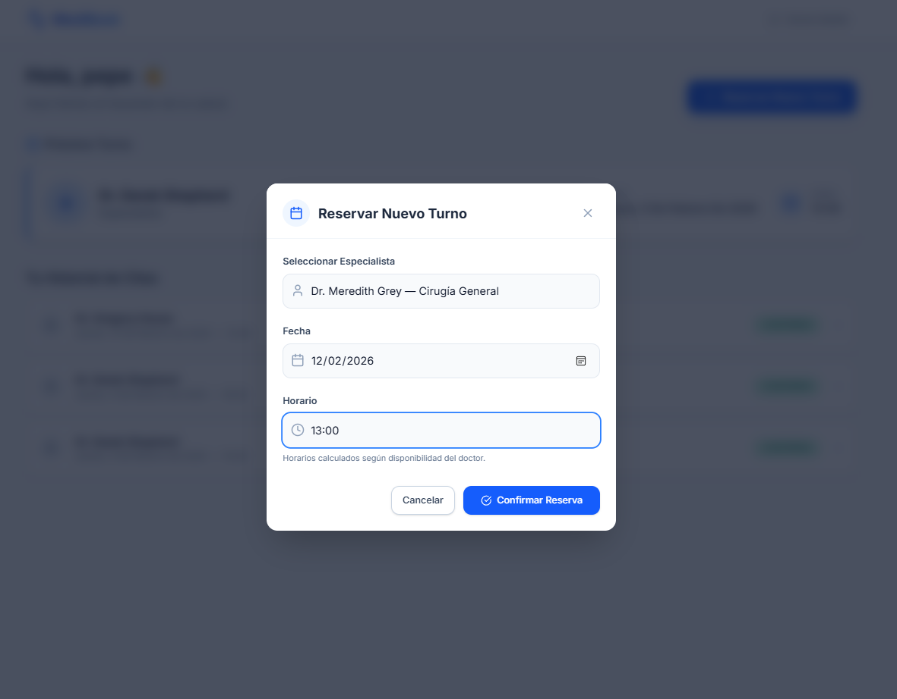

## 🏥 MediBook  
### Plataforma SaaS de Gestión Médica Integral


> **MediBook** es una plataforma **SaaS full-stack** orientada a la digitalización de centros médicos y consultorios.  
> Permite a pacientes y profesionales gestionar turnos de forma segura, eficiente y en tiempo real, optimizando la experiencia médica y reduciendo la carga administrativa.

---

## 📸 Vista General

  
*Landing institucional moderna y profesional.*

  
*Sistema de autenticación seguro.*

  
*Dashboard intuitivo para pacientes.*

  
*Reserva de turnos inteligente en tiempo real.*

---

## ✨ Funcionalidades Principales

- 🔐 **Seguridad Avanzada**
  - Autenticación JWT stateless
  - Control de acceso por roles (Admin / Patient)
  - Protección de endpoints con Spring Security

- 📅 **Gestión Inteligente de Turnos**
  - Cálculo dinámico de disponibilidad
  - Prevención de overbooking
  - Respeto de horarios médicos configurables

- 🎨 **Experiencia de Usuario**
  - Interfaz moderna y responsive
  - Validaciones en tiempo real
  - Diseño enfocado en usabilidad y claridad

---

## 🧱 Arquitectura y Stack Tecnológico

### Backend
- Java 21
- Spring Boot 3
- Spring Security + JWT
- Maven
- Arquitectura REST
- PostgreSQL

### Frontend
- React 18
- TypeScript
- Vite
- Tailwind CSS
- Arquitectura basada en componentes

---

## 🗂️ Estructura del Proyecto

```
medibook/
├── backend/
├── frontend/
└── README.md
```

---

## 🚀 Instalación y Ejecución Local

### Requisitos Previos
- Java 21
- Node.js 18+
- PostgreSQL
- Maven

### Clonar el repositorio
```bash
git clone https://github.com/TiagoFrencia/medibook.git
cd medibook
```

### Ejecutar Backend
```bash
cd backend
./mvnw spring-boot:run
```

### Ejecutar Frontend
```bash
cd frontend
npm install
npm run dev
```

---

## 📌 Estado del Proyecto

✅ MVP funcional  
🚧 En evolución  
🔮 Roadmap:
- Gestión de profesionales médicos
- Historial clínico
- Notificaciones (email / WhatsApp)
- Panel administrativo avanzado
- Deploy productivo con Docker y Cloud

---

## 👤 Autor

**Tiago Frencia**  
Desarrollador Full Stack  

- 💻 GitHub: https://github.com/TiagoFrencia  
- 💼 LinkedIn: https://www.linkedin.com/in/tiagofrencia/
